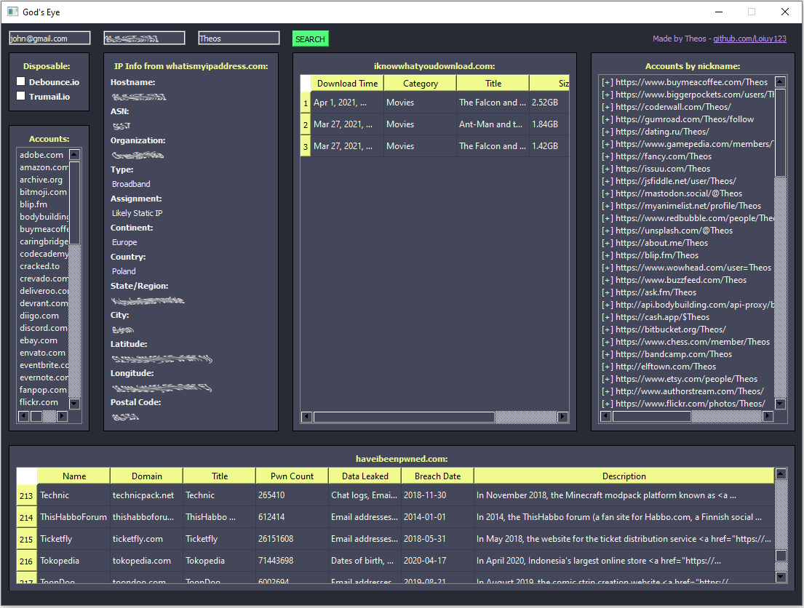

<p align=center>
  
  <br>
  <span>OSINT - Gather information about target.</span>
  <br>
  
  
  
</p>

## What is God's Eye

**God's Eye** is an email, nickname and IP OSINT and breach hunting tool. Everything with clear and simple GUI.

## Features

- Check if email is [disposable](https://en.wikipedia.org/wiki/Disposable_email_address)
- List accounts from the popular websites created using target email
- Look for data breaches associated with target email
- Get information about target IP using [whatismyipaddress.com](https://whatismyipaddress.com/)
- Check what the target IP was downloading via Torrent
- List accounts from the popular websites created using target nickname

More in the future!

## Installation

```console
# clone the repo
$ git clone https://github.com/Loiuy123/God-s-Eye.git

# change the working directory to GodsEye
# cd GodsEye

# install required libraries
# pip install -r requirements.txt
```

## Showcase



## Contributing
We would love to have you help me with the development of **God's Eye**. Each and every contribution is greatly valued! Contact me via Discord - Theos#2613

## Support
If you appreciate my work and wish to support it, feel free to: <a href="https://www.buymeacoffee.com/theos"></a>
